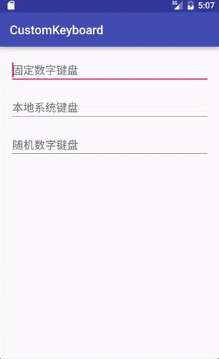

### 自定义数字键盘

该Library仅仅是因为需求自定义的一个类似与微信支付时显示的密码键盘，不同样式的键盘可以在项目中`xml`目录下定义不同的键盘格式，主要包含`Keyboard`、`Row`、`Key` 这些都是系统提的自定义键盘的`xml`格式，里面也包含了一些设置属性，可根据需求自行定制。

效果图：

 

### 使用方法

使用也很简便，只需创建一个`CustomKeyboardHelper` 实例，然后将需要使用自定义键盘的`EditText`注册给该`help`实例即可：

```java
// 参数需要是一个Activity
CustomKeyboardHelper helper = new CustomKeyboardHelper(this);

// 使用固定数字键盘
helper.registerEditText(editText1);
// 使用随机数字键盘
helper.registerEditText(editText3, true);
```

不同键盘样式可以使用2个参数的构造方法，传递`keyboard`对应的`xml`：

```java
helper = new CustomKeyboardHelper(this,R.xml.keyboardnumber);
```

不同的按键功能可以参考`CustomKeyboardHelper`中的实现自行定义。

